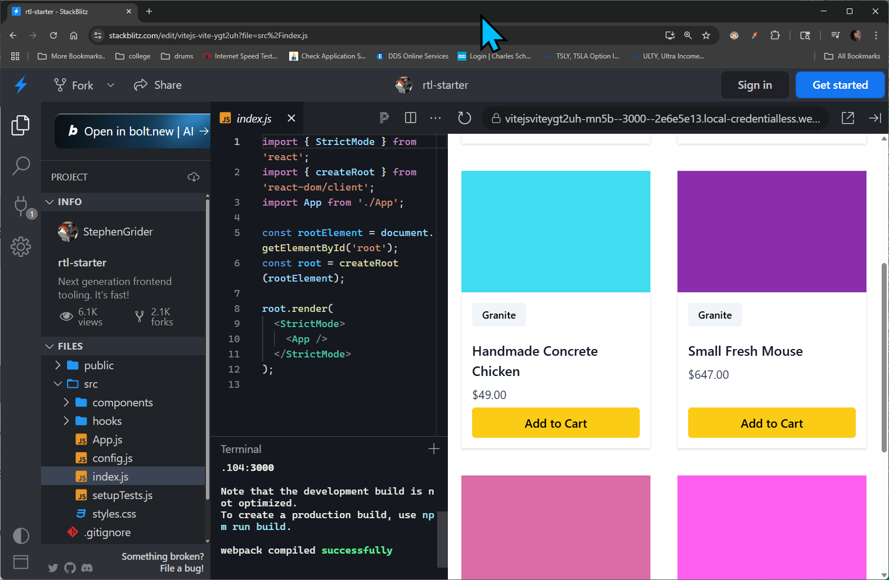

## Section 1: Dive in - Let's Get Started
[Section 1 video link](https://www.udemy.com/course/react-testing-library-and-jest/learn/lecture/42425978#overview)

### Lecture 1. How to Get Help
- Give a brief overview of the Q&A section and where to find help.

### Lecture 2. Start Testing... Now
Go to the following link for a [small project](https://stackblitz.com/edit/vitejs-vite-ygt2uh)
- This is a simple React project that you can use to practice your testing skills.
- 

1. Within the `src` folder, create a new file called `App.test.js`.
    - Write the following code:
    - For now don't worry about what it does, we will break it down later.
    ```javascript
    import { render, screen, waitFor } from '@testing-library/react';
    import user from '@testing-library/user-event';
    import App from './App';
   
    test('shows 6 items by default', async () => {
        render(<App />);
        const titles = await screen.findAllByRole('heading');
        expect(items).toHaveLength(6);
    });
   
    test('clicking on the button loads 6 more products', async () => {
        render(<App />);
        const button = screen.findByRole('button', { name: 'Load More' });
        await user.click(button);
   
        await waitFor(async () => {
            const titles = await screen.findAllByRole('heading');
            expect(titles).toHaveLength(12);
        });
    });
    ```

2. Open up a terminal window (another one part from the one already running) and run the following commands:
    - To run the tests
    ```bash
    yarn test
    ```
   - A prompt saying both tests passed successfully should happen.

### Lecture 3. A few Critical Questions

- What were all those `import` statements?
The import statements bring in necessary modules and components for testing.
@testing-library/react provides utilities for rendering components and querying the DOM,
 @testing-library/user-event simulates user interactions, and App is the React component being tested.

- How were our tests found?
The testing framework (Jest) automatically detects files with .test.js or .spec.js extensions in the project directory. 
It then executes the test cases defined within those files.

- What did all the testing code do?
The tests verify the behavior of the App component. 
The first test checks if 6 items are displayed by default. 
The second test simulates a button click and ensures that 6 additional items are loaded, 
making the total 12.


### Lecture 4. Join Our Community
We welcome you to join our Discord community of fellow students, 
developers, and engineers. Keep up with the latest news and
announcements or start a discussion by clicking here: https://discord.gg/h2G3CbxPZA