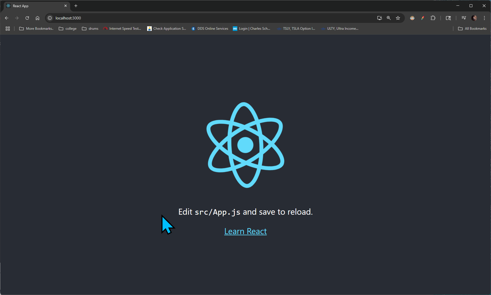
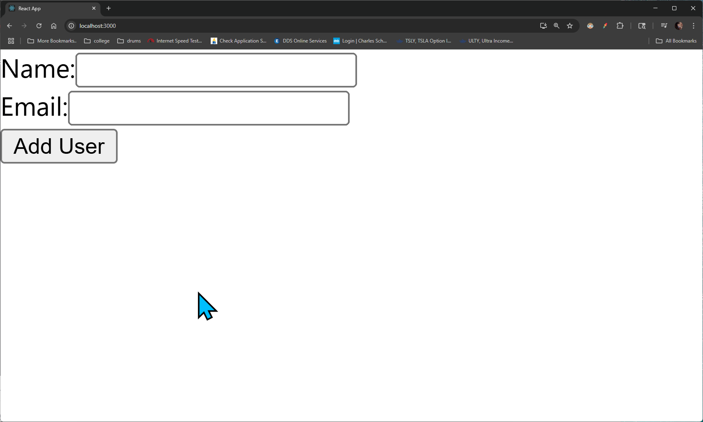
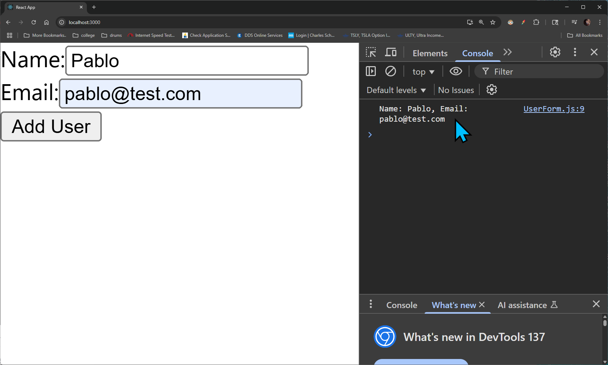
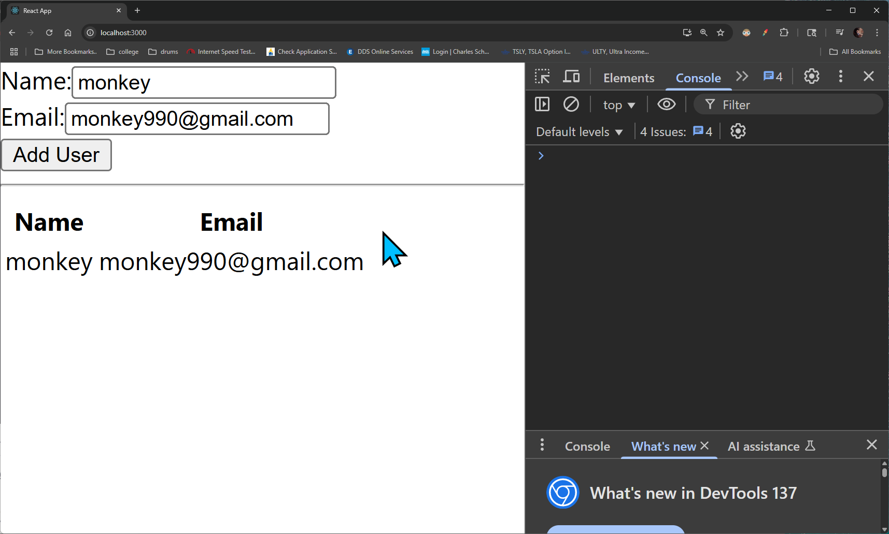

## Section 2: A Whirlwind Overview of Testing
[Section 2 video link](https://www.udemy.com/course/react-testing-library-and-jest/learn/lecture/35701604#overview)

### Lecture 5. Project Setup

For now we are going make simple project with Create React App and test it, and later 
we will use a large project with complex features, we will test it and add in new features.

- For our first project we will have simple mockup form at the top.
- The form will have a name and email input, and a submit button.
- Once submitted it will display the name and email below the form on a table.

1. To setup our project go to the terminal and run the following command:
   ```bash
   npx create-react-app 2users
   ```
   - This will create a new React project in a folder called `2users`.

### Lecture 6. Quick Note
The next three videos will show building a simple React app from scratch. 
No testing is covered in these videos, I only show how to build the app.

Don't want to spend time building a simple app? No problem! 
Skip ahead three to the videos to the lecture called 'Completed Users Project' 
and download the completed version of the project there.

### Lecture 7. Adding the Form

1. Open the terminal and run the following command: 
    ```bash
    npm start
    ```
    - This will start the project and should display the default page
    - 

2. Create the [UserForm.js](./2users/src/UserForm.js) and another one called [UserList.js](./2users/src/UserList.js) in the `src` folder.
    - Open the [UserForm.js](2users/src/UserForm.js) file and add the following code:
        ```js
        import React from 'react';
         
        function UserForm() {
            return (
                <form>
                    <div>
                        <label htmlFor="name">Name:</label>
                        <input type="text" id="name" name="name" required />
                    </div>
                    <div>
                        <label htmlFor="email">Email:</label>
                        <input type="email" id="email" name="email" required />
                    </div>
                    <button type="submit">Add User</button>
                </form>
            );
        }
         
        export default UserForm;
        ```
      
3. Open the [App.js](./2users/src/App.js) file, remove the old content and modify it to include the `UserForm` component:
    ```js
    import './App.css';
    import UserForm from "./UserForm";
    
    function App() {
      return (
        <div>
            <UserForm />
        </div>
      );
    }
    
    export default App;
    ```
   - This will render the `UserForm` component in the main App component.

4. Go to the browser and you should see the form:
   - 


### Lecture 8. Handling User Input
Right now our form doesn't do much, so we will update it to handle user input and display the data below the form.

1. Open the [UserForm.js](./2users/src/UserForm.js) file and modify it to include state and handle form submission:
    ```js
    import React, { useState } from 'react';
    
    function UserForm() {
        const [name, setName] = useState('');
        const [email, setEmail] = useState('');
    
        const handleSubmit = (e) => {
            e.preventDefault();
            console.log(`Name: ${name}, Email: ${email}`);
        };
    
        return (
            <form onSubmit={handleSubmit}>
                <div>
                    <label htmlFor="name">Name:</label>
                    <input 
                        type="text" 
                        id="name" 
                        name="name" 
                        value={name} 
                        onChange={(e) => setName(e.target.value)} 
                        required 
                    />
                </div>
                <div>
                    <label htmlFor="email">Email:</label>
                    <input 
                        type="email" 
                        id="email" 
                        name="email" 
                        value={email} 
                        onChange={(e) => setEmail(e.target.value)} 
                        required 
                    />
                </div>
                <button type="submit">Add User</button>
            </form>
        );
    }
    
    export default UserForm;
    ```
   - This code adds state management for the name and email inputs console logs it once submitted.
   - In the next lecture we will display the data below the form.

2. Go to the browser and you should see the log when you submit:
   - 


### Lecture 9. Rendering the List of Users

In this lecture, we updated our app to display a list of users below the form. Here are the changes made:

1. Update `App.js`
   - Add a `users` state to store the list of users.
   - Create an `onUserAdd` function to handle adding new users to the list.
   - Render the `UserForm` component and passed the `onUserAdd` function as a prop.
   - Render the `UserList` component and passed the `users` state as a prop.

   ```js
   import './App.css';
   import UserForm from "./UserForm";
   import { useState } from "react";
   import UserList from "./UserList";

   function App() {
       const [users, setUsers] = useState([]);

       const onUserAdd = (user) => {
           setUsers([...users, user]);
       };

       return (
           <div>
               <UserForm onUserAdd={onUserAdd} />
               <hr />
               <UserList users={users} />
           </div>
       );
   }

   export default App;
   ```

2. Updated UserForm.js:  
- Add onUserAdd as a prop to handle form submission.
- Modify the handleSubmit function to call onUserAdd with the user data (name and email).
```js
import React, { useState } from 'react';

function UserForm({ onUserAdd }) {
const [name, setName] = useState('');
const [email, setEmail] = useState('');

    const handleSubmit = (e) => {
        e.preventDefault();
        onUserAdd({ name, email });
    };

    return (
        <form onSubmit={handleSubmit}>
            <div>
                <label htmlFor="name">Name:</label>
                <input
                    type="text"
                    id="name"
                    name="name"
                    value={name}
                    onChange={(e) => setName(e.target.value)}
                    required
                />
            </div>
            <div>
                <label htmlFor="email">Email:</label>
                <input
                    type="email"
                    id="email"
                    name="email"
                    value={email}
                    onChange={(e) => setEmail(e.target.value)}
                    required
                />
            </div>
            <button type="submit">Add User</button>
        </form>
    );
}

export default UserForm;
```

3. Created UserList.js:  
- Added a UserList component to render the list of users in a table format.
- Used the users prop to map over the list and display each user's name and email.
```js
import React from 'react';

function UserList({ users }) {
const renderedUsers = users.map((user) => {
return (
<tr key={user.email}>
<td>{user.name}</td>
<td>{user.email}</td>
</tr>
);
});

    return (
        <table>
            <thead>
                <tr>
                    <th>Name</th>
                    <th>Email</th>
                </tr>
            </thead>
            <tbody>
                {renderedUsers}
            </tbody>
        </table>
    );
}

export default UserList;
```

With these changes, the app now displays a table of users below the form after submission.



### Lecture 10. Completed Users Project
Completed Users Project
The completed source code for the users project is attached. To run the project, do the following:

1. Download the attached zip file

2. Extract the zip file

3. Navigate into the project directory at your terminal and run 'npm install'

4. After installing dependencies, run npm start

Resources for this lecture

### Lecture 11. Our First Test

**Test Writing Process**
1. Pick out one component to test all by itself.
2. Make a test file for the component if one does not exist.
3. Decide what the important parts of the component are.
4. Write a test to make sure each part works as expected
5. Run tests at the command line.

So right now the want to test the `UserForm` component, so we will create a test file for it.

1. Create a new file called [UserForm.test.js](./2users/src/UserForm.test.js) in the `src` folder.
    - Add the following code to the file:
        ```js
        import { render, screen } from "@testing-library/react";
        import user from "@testing-library/user-event";
        import UserForm from "./UserForm";
        
        test('it shows two inputs and a button', () => {
            render(<UserForm />);
        
            const inputs = screen.getAllByRole('textbox');
            const button = screen.getByRole('button', { name: /add user/i });
        
            expect(inputs).toHaveLength(2);
            expect(button).toBeInTheDocument();
        });
        ```
      
2. Open the terminal and run the following command:
    ```bash
    npm run test
    ```
   - This will run the tests and should display passed.
   - Note: There is a default `App.test.js` file created by Create React App, ignore it for now. We'll fix it later.


### Lecture 12. Element Query System

In this lecture, we explored the element query system provided by `@testing-library/react` for testing React components. The key points covered are:

1. **Query Methods**:
   - `getByRole`: Finds elements by their semantic role (e.g., `button`, `textbox`, `heading`).
   - `getByLabelText`: Finds elements associated with a `<label>` element.
   - `getByPlaceholderText`: Finds elements by their `placeholder` attribute.
   - `getByText`: Finds elements by their visible text content.
   - `getByAltText`: Finds elements by their `alt` attribute (commonly used for images).
   - `getByTitle`: Finds elements by their `title` attribute.

2. **Variants of Query Methods**:
   - `getBy*`: Throws an error if no matching element is found.
   - `queryBy*`: Returns `null` if no matching element is found.
   - `findBy*`: Returns a promise and waits for the element to appear (useful for async operations).

3. **Multiple Elements**:
   - `getAllBy*`, `queryAllBy*`, and `findAllBy*` are used to query multiple elements.

4. **Best Practices**:
   - Prefer `getByRole` for accessibility testing as it ensures elements are properly labeled.
   - Use `findBy*` for elements that appear asynchronously.
   - Avoid relying on `getByTestId` unless necessary, as it bypasses semantic and accessibility checks.


### Lecture 13. Understanding ARIA Roles

In this lecture, we learned about ARIA (Accessible Rich Internet Applications) roles and their importance in making web applications accessible. Key points covered include:

1. **What are ARIA Roles?**
   - ARIA roles define the purpose of an element on a web page, making it easier for assistive technologies (like screen readers) to interpret the content.
   - Examples include `button`, `textbox`, `heading`, `alert`, and `dialog`.

2. **Why Use ARIA Roles?**
   - They improve accessibility by providing semantic meaning to elements.
   - They help ensure that custom components are accessible to all users.

3. **Common ARIA Roles in React Testing**:
   - `button`: Represents a clickable button.
   - `textbox`: Represents an input field for text.
   - `heading`: Represents a section heading.
   - `link`: Represents a hyperlink.
   - `alert`: Represents a message that requires immediate attention.

4. **Testing ARIA Roles**:
   - Use `getByRole` from `@testing-library/react` to query elements by their ARIA roles.
   - Example:
     ```javascript
     import { render, screen } from "@testing-library/react";
     import UserForm from "./UserForm";

     test('it shows two inputs and a button', () => {
         render(<UserForm />);

         // ARIA roles for inputs and button
         const inputs = screen.getAllByRole('textbox');
         const button = screen.getByRole('button', { name: /add user/i });

         expect(inputs).toHaveLength(2);
         expect(button).toBeInTheDocument();
     });
     ```

5. **Best Practices**:
   - Always use semantic HTML elements (e.g., `<button>`, `<input>`, `<h1>`) to ensure proper ARIA roles are applied automatically.
   - Avoid manually adding ARIA roles unless necessary for custom components.

By understanding ARIA roles, you can create accessible applications and write better tests that ensure your components are usable for everyone.

### Lecture 14. Understanding Jest Matchers

In this lecture, we explored Jest matchers, which are used to write assertions in tests. Key points covered include:

1. **Basic Matchers**:
   - `toBe`: Tests for strict equality.
     ```javascript
     expect(2 + 2).toBe(4);
     ```
   - `toEqual`: Tests for deep equality (useful for objects and arrays).
     ```javascript
     expect({ name: 'John' }).toEqual({ name: 'John' });
     ```

2. **Truthiness Matchers**:
   - `toBeNull`: Tests if a value is `null`.
   - `toBeUndefined`: Tests if a value is `undefined`.
   - `toBeDefined`: Tests if a value is not `undefined`.
   - `toBeTruthy`: Tests if a value is truthy.
   - `toBeFalsy`: Tests if a value is falsy.

3. **Number Matchers**:
   - `toBeGreaterThan`, `toBeLessThan`, `toBeGreaterThanOrEqual`, `toBeLessThanOrEqual`: Compare numeric values.
     ```javascript
     expect(10).toBeGreaterThan(5);
     ```

4. **String Matchers**:
   - `toMatch`: Tests if a string matches a regular expression.
     ```javascript
     expect('Hello World').toMatch(/World/);
     ```

5. **Array and Iterable Matchers**:
   - `toContain`: Tests if an array or iterable contains a specific item.
     ```javascript
     expect([1, 2, 3]).toContain(2);
     ```

6. **Exception Matchers**:
   - `toThrow`: Tests if a function throws an error.
     ```javascript
     expect(() => {
         throw new Error('Error!');
     }).toThrow('Error!');
     ```

7. **Best Practices**:
   - Use matchers that best describe the expected behavior for clarity.
   - Combine matchers with `not` for negations (e.g., `expect(value).not.toBeNull()`).

By understanding Jest matchers, you can write clear and effective tests for your React components and applications.


### Lecture 15. Note

**test was not wrapped in act(...) Warning and Test Failure
In the upcoming lecture, we will be testing simulated user events. When executing the tests you will see this message in your terminal:**

"Warning: An update to UserForm inside a test was not wrapped in act(...)"

React Testing Library (RTL) just saw a major v14 update a few weeks ago. Create React App (CRA) has not updated its versions of RTL, so, there are currently some major conflicts with the dependencies that are being installed.

Most importantly, user events are now async:

https://testing-library.com/docs/user-event/intro/#writing-tests-with-userevent

To resolve the testing errors in this project and anywhere else in the course that shows user events like user.click, user.keyboard, etc, you'll need to make the test function async:

test("it calls onUserAdd when the form is submitted", async () => {

Then, add the await keyword wherever there is a user action:

await user.click(nameInput);

The act warnings appear to be a bug that was introduced in a v13 RTL update and then fixed with v14. You may choose to ignore the warnings as they should not affect your tests. If you wish to resolve them, you can uninstall the current version of RTL that CRA installed and re-install with the latest versions:

npm uninstall @testing-library/jest-dom @testing-library/react @testing-library/user-event

npm install @testing-library/jest-dom @testing-library/react @testing-library/user-event

We have included a zip file that contains the updated code and working versions as a zip file to this lecture as well as the Simulating User Events lecture.
Again, as a reminder, this guidance will apply to all usages of user events throughout the course.

Complete UserForm.test.js
```js
import { render, screen } from "@testing-library/react";
import user from "@testing-library/user-event";
import UserForm from "./UserForm";

test("it shows two inputs and a button", () => {
// render the component
render(<UserForm />);

// Manipulate the component or find an element in it
const inputs = screen.getAllByRole("textbox");
const button = screen.getByRole("button");

// Assertion - make sure the component is doing
// what we expect it to do
expect(inputs).toHaveLength(2);
expect(button).toBeInTheDocument();
});

test("it calls onUserAdd when the form is submitted", async () => {
// NOT THE BEST IMPLEMENTATION
// Try to render my component
render(<UserForm />);

// Find the two inputs
const [nameInput, emailInput] = screen.getAllByRole("textbox");

// Simulate typing in a name
await user.click(nameInput);
await user.keyboard("jane");

// Simulate typing in an email
await user.click(emailInput);
await user.keyboard("jane@jane.com");

// Find the button

// Simulate clicking the button

// Assertion to make sure 'onUserAdd' gets called with email/name
});  
```

### Lecture 16. Simulating User Events

In this lecture, we learned how to simulate user events wwin React Testing Library using the `user-event` library. Key points covered include:
1. **User Event Simulation**:
   - The `user-event` library allows us to simulate user interactions like clicks, typing, and more.
   - It provides a more realistic simulation compared to the built-in `fireEvent`.
