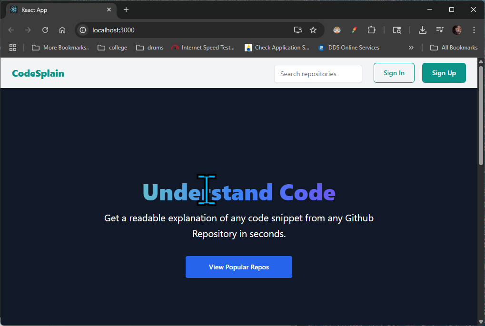
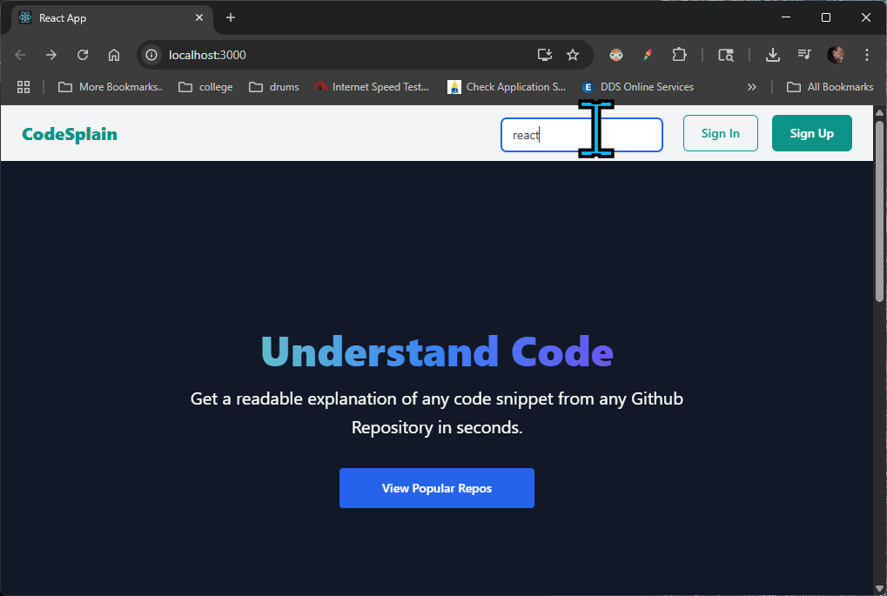
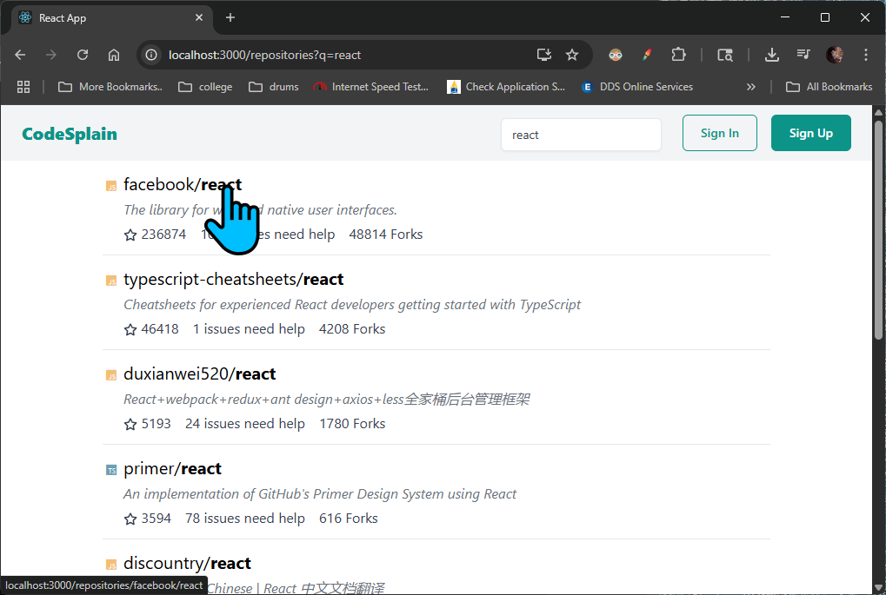
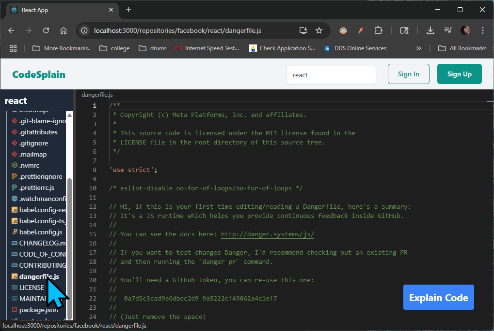
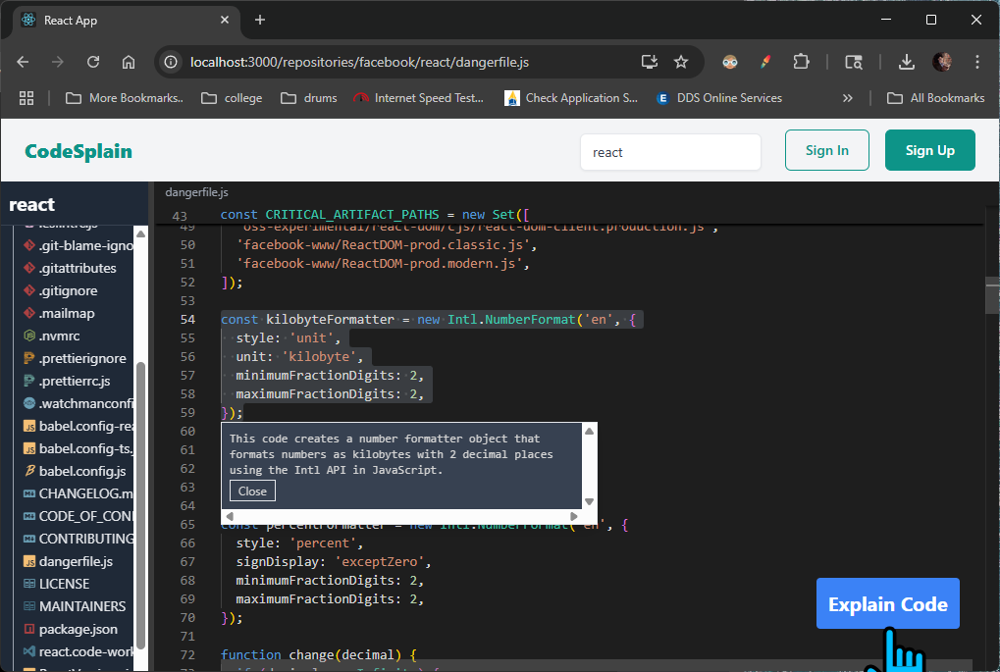

## Section 7: Big Project Overview
[Section 7 video link](https://www.udemy.com/course/react-testing-library-and-jest/learn/lecture/35701704#overview)

### Lecture 52. Required Project Setup - Do Not Skip

Attached is a codesplain.zip file. Please download this file to your computer as we will be using it in the very next lecture.

### Lecture 53. App Overview and Setup

In this lecture, we will set up the project and provide an overview of the application we will be building.

1. Once you finish extracting the file open the terminal and navigate to the folder where you extracted the file.
    - For example, if you extracted the file to your project folder `react-testing-course-by-stephen`, you can use the command:
      ```bash
      cd ~/react-testing-course-by-stephen/codesplain
      ```
    - Install the dependencies by running:
      ```bash
      npm install
      ```  
    - Start the development server:
      ```bash
      npm start
      ```
    - Open your browser and navigate to `http://localhost:3000` to see the application running.
    - 

2. The application is a simple code explanation tool that allows users to submit code snippets and receive explanations.
    - Go to the searchbar and search for `react`
    - 
    - You will see a list of code snippets related to React.
    - Click on any of the code snippets to view its details.
    - 
    - This will show all the files and code snippets related to the repo.
    - Scroll down and select `dangerfile.js` to view the code snippet.
    - 
    - Now highlight the code snippet and click on the `Explain Code` button.
    - 

That is the overview of the application we will be building. In the next lectures, we will start writing tests for the application and implement the features step by step.

### Lecture 54: The Tech in This Project

This lecture focuses on the technologies used in the `7codesplain` project and how they interact to fetch and display GitHub repositories.

---

#### **Tech Stack Overview**
1. **React**: The core framework for building the user interface.
2. **Axios**: A promise-based HTTP client used to make API requests.
3. **SWR (Stale-While-Revalidate)**: A React hook library for data fetching, caching, and revalidation.
4. **GitHub API**: The external API used to fetch repository data.

---

#### **How It Works**
1. **Fetching Data**:
   - Axios is used to make HTTP requests to the GitHub API.
   - The API endpoint retrieves repositories based on a search query or user input.

2. **Using SWR**:
   - SWR handles caching and revalidation of the fetched data.
   - It ensures the UI remains responsive by showing cached data while fetching fresh data in the background.

3. **Displaying Repositories**:
   - The fetched repository data is displayed in a list format.
   - Users can click on a repository to view its details and related code snippets.

This combination ensures efficient and responsive data fetching while keeping the UI up-to-date with minimal latency.

### Lecture 55: The Path Ahead

In this lecture, we will outline the steps we will take to build the `codesplain` application. The project will be developed incrementally, focusing on writing tests first and then implementing the features.
If you don't know anything about React Router or SWR, that's okay because MOST of testing is about figuring out code that other engineers wrote.

#### **How People Think Testing Works**
- Write Code.
- Immediately write tests with perfect knowledge of the code.
- Everything is super easy and works the first time.

#### **Testing in Reality**
- Users complain to your companies support team about a bug.
- Support team gives a workaround to the bug.
- Support team gets tired of teh 1 million tickets being filed and tells a project manager about the bug.
- Project manager tells an engineering manager that the bug needs to be fixed.
- Engineering manager tells you to fix the bug, probably without a lot of details.
- You need to find teh bug fix it and write a test to confirm it is fixed.

#### **The Plan Ahead**
- We are going to pretend we are engineers working on the codesplain project.
- We are going to receive bug reports that sometimes provide... less information than we'd hope for.
- Figure out how to find the relevant code + fix it.
- Figure out how to write code to confirm the bug is fixed.

### Lecture 56: A Process for Debugging

#### **List of repositories should show the repositories main language**

- **Steps to reproduce**: 
  1. Enter a search term.
  2. Press Enter
  
- **Expected Result**: 
  1. Show search results.
  2. Each repository shows # of stars, # issues, # of forks, and primary language used in the repo
- **Actual Result**: 
  1. Search results are visible.
  2. Primary language of each repository is missing

#### **The Bug Fixing Process**
1. Find the relevant components in the codebase
   - Use **React Developer Tools**
   - Search the codebase for text/icons/classnames that the component is producing.
   - If an error is being thrown, look at the stack trace.
   - Ask another engineer.
2. Figure out how the component is getting its data/state/props
3. Use a debugger, console.log, or other debugging tools to inspect the data
4. Implement a fix
5. Test the fix

### Lecture 57: Understanding Data Flowing into the Component

This lecture focuses on understanding how data flows into the components of the `codesplain` project, particularly to identify and fix the bug where the primary language of repositories is missing in the search results.

---

#### **Steps to Explore the Codebase**
1. **Identify the Relevant Component**:
   - Use the React Developer Tools to inspect the component rendering the repository list.
   - Look for the component responsible for displaying repository details (e.g., stars, issues, forks).

2. **Trace the Data Flow**:
   - Check how the repository data is fetched from the GitHub API.
   - Look for the API call in the codebase (likely using Axios or SWR).
   - Verify if the API response includes the `language` field for each repository.

3. **Inspect Props and State**:
   - Examine how the fetched data is passed as props or stored in the component's state.
   - Ensure the `language` field is being passed correctly to the repository list component.

4. **Debugging the Missing Data**:
   - Use `console.log` or a debugger to inspect the API response and the props/state of the component.
   - Confirm if the `language` field is missing in the API response or is not being passed to the component.

---

#### **Key Areas to Check**
1. **API Call**:
   - Verify the GitHub API endpoint being used (e.g., `https://api.github.com/search/repositories?q={query}`).
   - Ensure the API response includes the `language` field for each repository.

2. **Data Transformation**:
   - Check if the data is being transformed or filtered before being passed to the component.
   - Ensure the `language` field is not accidentally omitted during this process.

3. **Component Rendering**:
   - Inspect the repository list component to ensure it is rendering the `language` field correctly.
   - Look for the JSX code responsible for displaying repository details.

---

#### **Next Steps**
- Once the data flow is understood, implement a fix to ensure the `language` field is fetched, passed, and displayed correctly.
- Write a test to confirm the fix and prevent regressions.

### Lecture 58. Developing a Test and a Fix

This lecture focuses on identifying the bug in the `codesplain` project and implementing a test and fix for the missing primary language in the repository list.

1. Open the [routes.mjs](./7codesplain-starter/server/routes.mjs)
   - Update it to include new routes for fetching repository data.
   - Ensure the API endpoint provides the `language` field in the response.
   - Changing this line:
       ```js
       routes.post('/api/explain', async (req, res) => {
       ```
   - To this one
       ```js
       routes.post('/api/explain', requireUser, async (req, res) => {
       ```

2. Open the [RepositoriesSummary.js](./7codesplain-starter/src/components/repositories/RepositoriesSummary.js):
   - Modify it to display the primary language of each repository.
   - Added JSX to render the `language` field.
       ```js
       import { StarIcon } from '@primer/octicons-react';
       
       function RepositoriesSummary({ repository }) {
         const { stargazers_count, open_issues, forks, language } = repository;
       
         return (
           <div className="flex flex-row gap-4 text-gray-700">
             <div>
               <StarIcon aria-label="stars" size={16} /> {stargazers_count}
             </div>
             <div>{open_issues} issues need help</div>
             <div>{forks} Forks</div>
             <div>{language}</div>
           </div>
         );
       }
       
       export default RepositoriesSummary;
       ```

3. Create the [RepositoriesSummary.test.js](./7codesplain-starter/src/components/repositories/RepositoriesSummary.js) within the repositories directory:
   - New test added to verify the primary language is displayed correctly.
   - Mock data includes the `language` field.
   - The test will:
       - Mock the API response to include the `language` field.
       - Write assertions to check if the primary language is displayed.
   - Add the following code to the `RepositoriesSummary.test.js` file: 
       ```js
       import { screen, render } from '@testing-library/react';
       import RepositoriesSummary from './RepositoriesSummary';
       
       test('displays the primary language of the repository', () => {
         const repository = {
           language: 'Javascript',
           stargazers_count: 5,
           forks: 30,
           open_issues: 1,
         };
         render(<RepositoriesSummary repository={repository} />);
       
         const language = screen.getByText('Javascript');
       
         expect(language).toBeInTheDocument();
       });
       ```

### Lecture 59. Looping Over Assertions

This lecture introduces looping over assertions to improve test readability and efficiency.

1. Open the [RepositoriesSummary.test.js](./7codesplain-starter/src/components/repositories/RepositoriesSummary.js) within the repositories directory:
   - New test added to verify the primary language is displayed correctly.
   - Mock data includes the `language` field.
   - The test will:
      - Mock the API response to include the `language` field.
      - Write assertions to check if the primary language is displayed.
   - Add the following code to the `RepositoriesSummary.test.js` file:
       ```js
       import { screen, render } from '@testing-library/react';
       import RepositoriesSummary from './RepositoriesSummary';
    
       test('displays the primary language of the repository', () => {
         const repository = {
           language: 'Javascript',
           stargazers_count: 5,
           forks: 30,
           open_issues: 1,
         };
         render(<RepositoriesSummary repository={repository} />);
    
         const language = screen.getByText('Javascript');
    
         expect(language).toBeInTheDocument();
       });
       ```

### Lecture 60. Flexible Queries Over Changes in the Commit Log

#### **Overview**
This lecture focuses on using flexible queries to make tests adaptable to UI changes.

#### **Modified Files**
1. **`RepositoriesSummary.test.js`**:
   - Updated tests to use regex patterns for text matching.

2. **`setupTests.js`**:
   - Configured testing utilities for flexible queries.

#### **Steps to Implement**
1. Use regex patterns for case-insensitive matching.
2. Leverage `screen.queryByText` for optional elements.

#### **Code Example**
```javascript
mockRepositories.forEach((repo) => {
  expect(screen.getByText(new RegExp(repo.name, 'i'))).toBeInTheDocument();
  expect(screen.getByText(new RegExp(repo.language, 'i'))).toBeInTheDocument();
});
```

---

### Additional Notes on Modified Files

1. **`EditorPanel.js`**:
   - Updated to handle new repository data fields.
   - Ensure the `language` field is passed correctly to child components.

2. **`FileIcon.js`**:
   - Added support for displaying icons based on file types.

3. **`HomeRoute.js`**:
   - Updated to include logic for fetching and displaying repository summaries.

These changes ensure the bug is fixed and tests are robust against future UI updates.